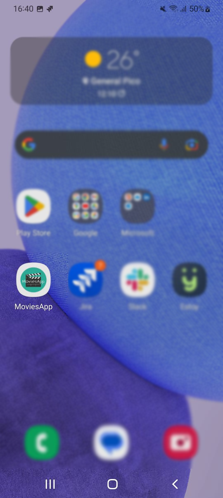
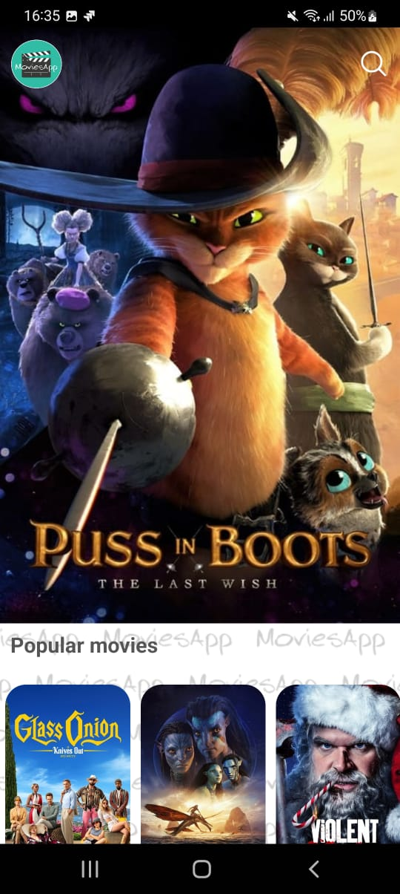
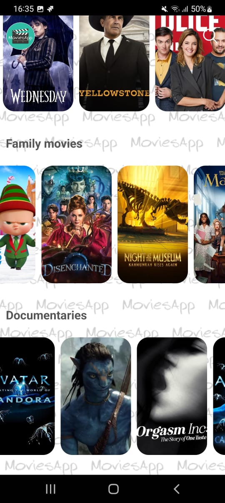
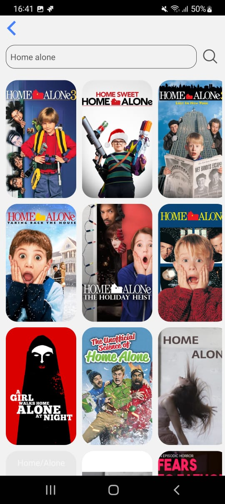

# movies-app-react-native 
App created as a result of this [React Native course](https://www.udemy.com/course/react-native-learn-by-doing-movies-app/).

# Overview
In Movies app you can check all your favorite movies and TV shows information.

# Data source
All the data is being gathered by using the [TheMovieDB API](https://developers.themoviedb.org/) for developers (special thanks! 🎉).

# Screens

- **Home** / main view showing all movies and TV shows
- **Detail** / show movie or TV show details
- **Search** / find movies or TV shows by keyword in the whole database

# 3rd party libs
Some of the utilities included are:

- `react-native-video-controls`: Video player used in the Details screen
- `react-native-image-slider-box`: Used in the Home screen to show all upcoming movies in a carousel
- `react-native-star-rating-widget`: Displays rating using stars

# Screenshots

## Mobile menu

## Home screen

## Detail screen

## Video player

## Search screen

